# 🌿 Aurora AI Companion – Health, Wellness & Fitness App

## 📌 Overview

**Aurora AI Companion** is an AI-powered mobile application designed to help users improve their overall health and wellness through intelligent tracking, personalized insights and daily health management.

The application enables users to monitor their hydration, sleep, nutrition and habits while interacting with an AI health assistant that provides personalized recommendations based on their wellness data.

---

# 📱 Application Preview

### Splash Screen

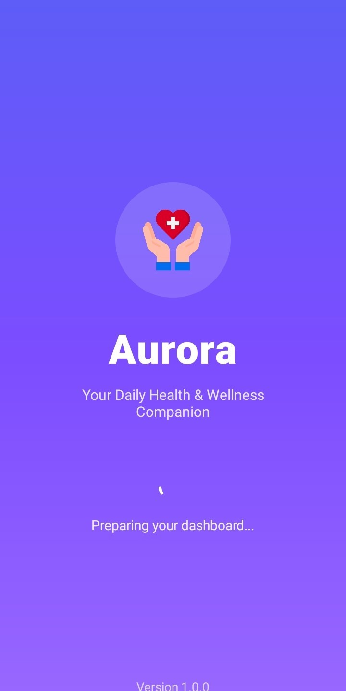

### Onboarding Screen

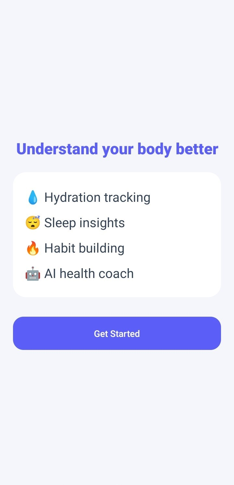

## 🔐 Authentication

### Login Screen

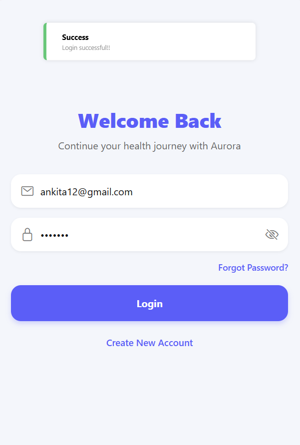

### Signup Screen

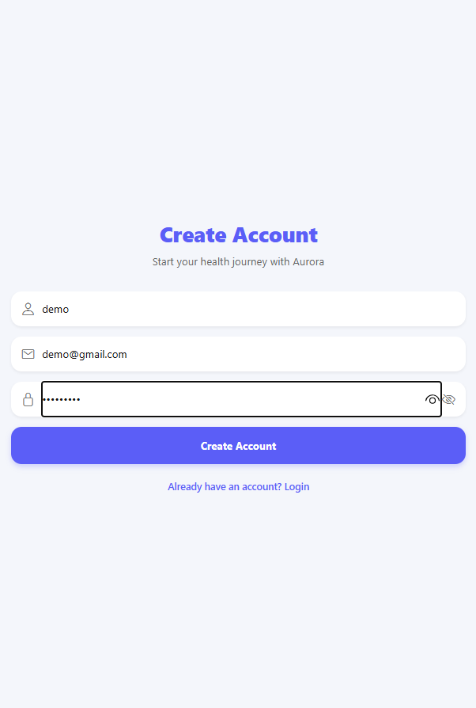

### Signup Details Screen

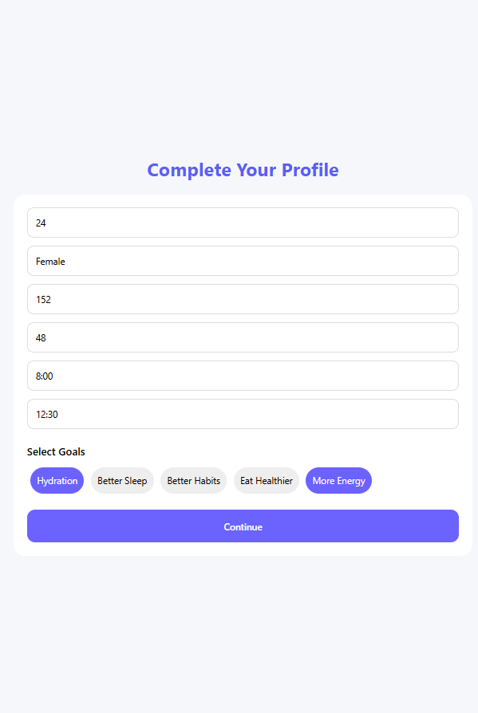

---

## 🏠 Dashboard

### Home Screen

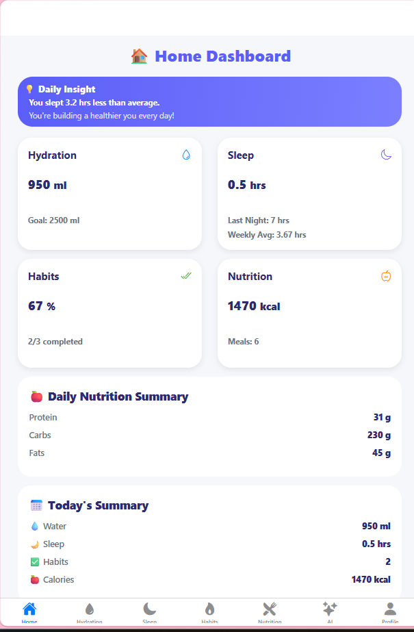

---

## 🤖 AI Health Assistant

### AI Chat Screen

.png>)
<<<<<<< HEAD

.png>)

=======
.png>)
>>>>>>> 5cc6b736 (Initial commit: Aurora AI Companion)
.png>)

The AI assistant helps users:

- Answer health and wellness queries
- Provide personalized suggestions
- Analyze user health records
- Give guidance based on sleep, hydration, nutrition and habits

---

## 💧 Hydration Tracking

### Water Tracking Screen

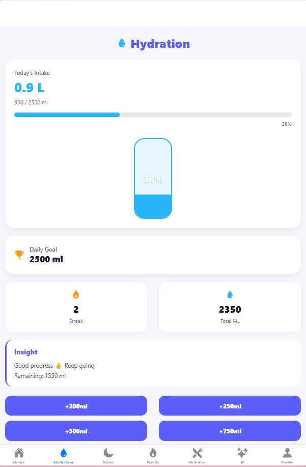

Features:

- Add daily water intake
- Monitor hydration goals
- View water consumption history

---

## 😴 Sleep Tracking

### Sleep Management Screen

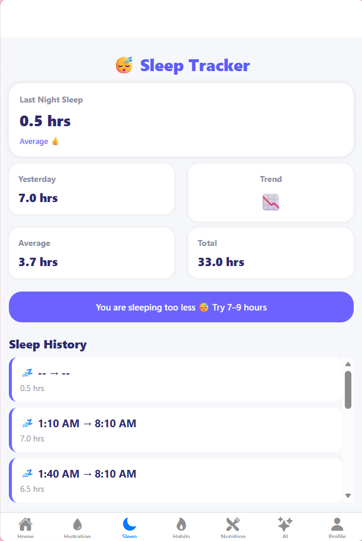

Features:

- Log sleeping hours
- Track sleep schedules
- Monitor sleep patterns

---

## 🥗 Nutrition Tracking

### Nutrition Screen

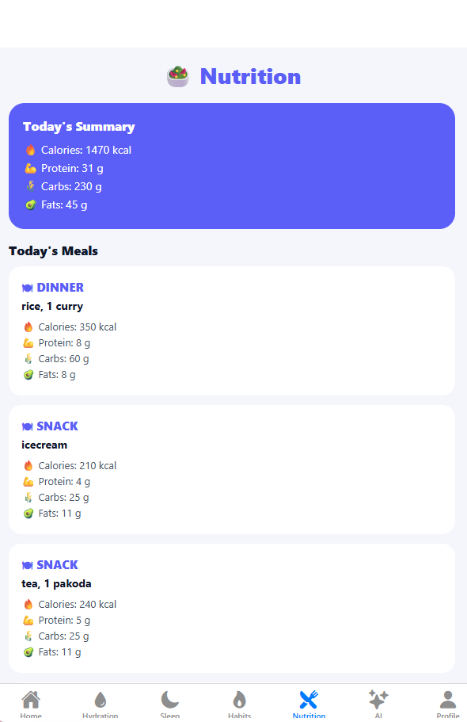

Features:

- Add daily meals
- Track calories and food records
- Maintain nutritional history

---

## 🏃 Habit Tracking

### Habit Management Screen

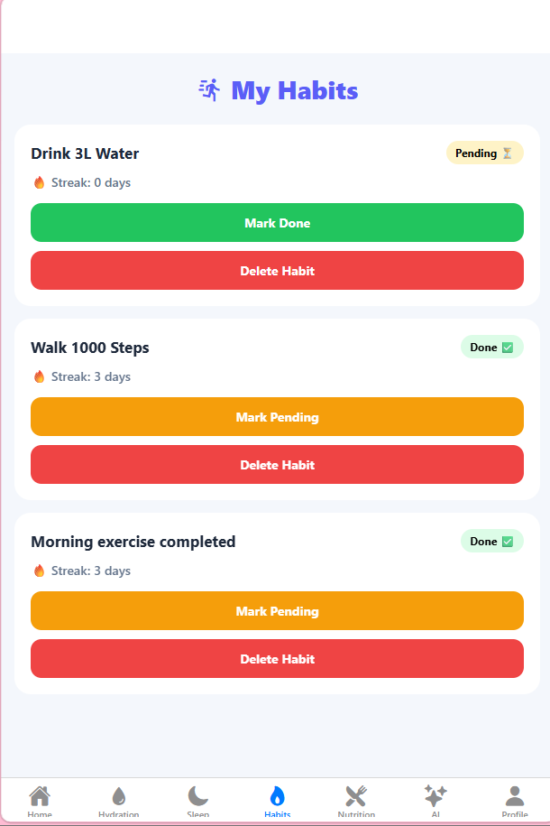

Features:

- Create healthy habits
- Track completion status
- Maintain consistency over time

---

## 👤 Profile Management

### User Profile Screen

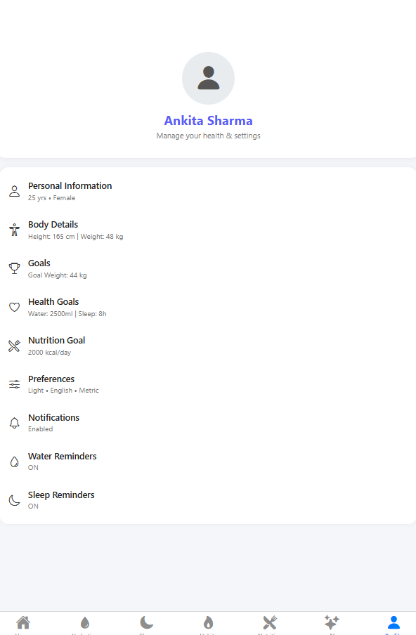

Features:

- Manage personal details
- View health information
- Customize user preferences

---

# ✨ Key Features

- 🤖 AI-powered health and wellness companion
- 💧 Daily hydration monitoring
- 😴 Sleep tracking and analysis
- 🥗 Nutrition and calorie management
- 🏃 Daily habit tracking
- 👤 User authentication and profile management
- 📊 Personalized AI recommendations
- 💬 Chat history management
- 🔒 Secure authentication using JWT

---

# 🛠️ Technology Stack

## Frontend

- React Native
- Expo
- JavaScript
- Redux Toolkit
- React Navigation
- AsyncStorage

## Backend

- Node.js
- Express.js
- REST API Architecture

## Database

- MongoDB
- Mongoose

## AI Integration

- Gemini API

---

# 📂 Project Structure

<<<<<<< HEAD
```text
=======
````

>>>>>>> 5cc6b736 (Initial commit: Aurora AI Companion)
AuroraTask/
│
├── .gitignore
├── README.md
│
├── mobile-aurora/
│   ├── src/
│   │   ├── assets/
│   │   │   └── Images/
│   │   ├── components/
│   │   ├── screens/
│   │   ├── redux/
│   │   └── utils/
│   ├── App.js
<<<<<<< HEAD
│   ├── package.json
│   └── ...
=======
│   └── package.json
>>>>>>> 5cc6b736 (Initial commit: Aurora AI Companion)
│
├── server/
│   ├── Controllers/
│   ├── Models/
│   ├── Routes/
│   ├── Middleware/
│   └── package.json
│
└── package.json
<<<<<<< HEAD
```
=======

>>>>>>> 5cc6b736 (Initial commit: Aurora AI Companion)
# 🚀 Installation & Setup

## 1. Clone the Repository

```bash
git clone  https://github.com/ankita12sharma/Aurora2026.git
````

## 2. Navigate to the Mobile Application

```bash
cd mobile-aurora
npm install
```

## 3. Run the React Native Application

```bash
npx expo start
```

## 4. Setup Backend Server

```bash
cd server
npm install
```

## 5. Start the Backend

```bash
npm start
```

---

# 🔐 Environment Variables

Create a `.env` file inside the backend directory and add the following:

```
PORT=8084
MONGODB_URL=<your_mongodb_connection_string>
<<<<<<< HEAD
GEMINI_API_KEY=<your_gemini_api_key>
=======
GEMINI_API_KEY=<your_openai_api_key>
>>>>>>> 5cc6b736 (Initial commit: Aurora AI Companion)
JWT_SECRET=<your_jwt_secret>
```

---

# 🌐 API Modules

The backend includes APIs for:

- User Authentication
- Profile Management
- AI Chat Assistant
- Hydration Tracking
- Sleep Tracking
- Nutrition Management
- Habit Management

---

# 🎥 Demo

## 📥 APK Download

Download Aurora AI Companion APK:
https://expo.dev/accounts/ankita_12/projects/mobile-aurora/builds/fed2e571-b4e5-4e4a-91f9-ae994ec2e246

---

# 🔮 Future Enhancements

- AI-generated weekly health reports
- Advanced health analytics dashboard
- Workout and exercise tracking
- Smart reminders and notifications
- Wearable device integration
- Improved AI personalization
- Multi-language support

---

# 🎯 Project Objective

The objective of Aurora AI Companion is to combine Artificial Intelligence with mobile health technology to provide users with a smart personal wellness assistant. The application encourages healthier lifestyle choices through daily tracking, intelligent analysis and personalized recommendations.

---

# 👩‍💻 Full Stack Developer

**Ankita Sharma**

Built with ❤️ using React Native, Node.js, Express.js, MongoDB and AI technologies.

---
